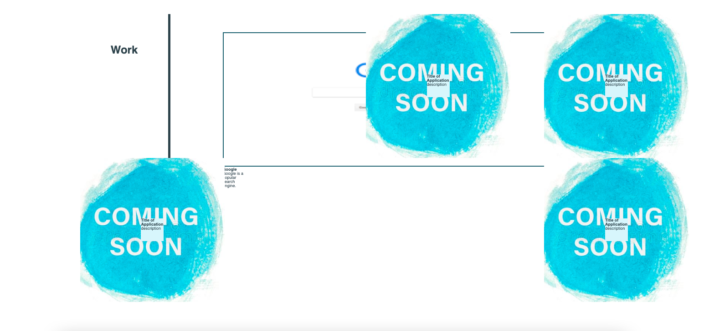
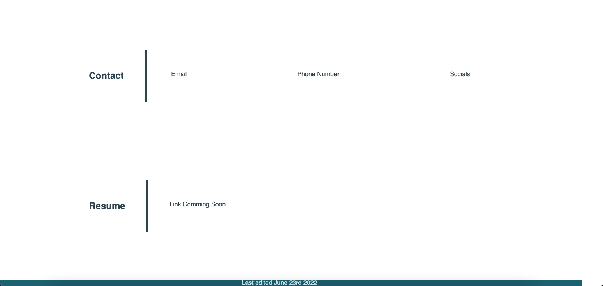

# UT-Bootcamp-Challenge-2
## Description
This project, I attempted to recreat an example web developer portfolio. A portfolio highlights the developer's work and contact information. The application includes four main sections with clickable links withing the application and one external link. My biggest challenge was with the positioning of elements and using the most efficeint CSS code as possible. In the future, i'd like to improve on targeting tags in a more efficient manner. 

## How To
Deployed Application: https://bralvis2.github.io/UT-Bootcamp-Challenge-2/

In order to run this project, follow the link provided.
Once you've landed on the application, you can click on the links at the top right of the page. Each link will take you to the appropriate section on the application. 
In the section titled "Work" you will find one external link when you click on the google image. 

## Credits
Thamk you to Leah for teaching us and providing me with plenty of examples to refrence. Thank you to the TA's Ian, Diem, and Ty for their help along the way. Additionally, thank you to my collegues for asking questions that helped me too!

Image Credits:
Main Banner Image: https://burst.shopify.com/photos/abstract-blue?c=api-colorful
Comming Soon Image place holder: https://www.dreamstime.com/coming-soon-blue-paint-background-isolated-white-advertising-banner-concept-image165187709
